# FHIRLab

FHIRLab provides a suite of FHIR-compliant healthcare interoperability services including Clinical Data Repositories (CDR), Terminology Servers, and EMR systems. This document describes the available components, their endpoints, and how they work together.

---

## Table of Contents

- [Architecture](#architecture)
- [Service Inventory](#service-inventory)
  - [Clinical Data Repository (CDR) Servers](#clinical-data-repository-cdr-servers)
  - [Terminology Servers](#terminology-servers)
  - [EMR / EHR Systems](#emr--ehr-systems)
- [Terminology Content](#terminology-content)
- [Validation & Operations](#validation--operations)
- [Quick Reference](#quick-reference)

---

## Architecture

The diagram below illustrates the FHIRLab infrastructure and how each component interacts:

```mermaid
graph TB
    subgraph Users["Users / Applications"]
        U["👤 User / Client Application"]
    end

    subgraph CDR["Clinical Data Repository Servers"]
        CDR1["cdr.fhirlab.net/fhir<br/>FHIRLab CDR"]
        CDR2["cdr.phcore.fhirlab.net/fhir<br/>PHCore CDR"]
    end

    subgraph TX["Terminology Servers"]
        TX1["tx.fhirlab.net/fhir<br/>FHIRLab Terminology<br/>(LOINC + SNOMED CT)"]
        TX2["snowstorm.fhirlab.net/fhir<br/>Snowstorm<br/>(SNOMED CT)"]
    end

    U -->|"CRUD Operations<br/>$validate"| CDR1
    U -->|"CRUD Operations<br/>$validate (PH Core IG)"| CDR2
    U -->|"$lookup<br/>$expand<br/>$validate-code"| TX1
    U -->|"$lookup<br/>$expand<br/>(SNOMED CT)"| TX2

    CDR1 -.->|"Remote Terminology<br/>$lookup forwarding"| TX1
    CDR2 -.->|"Remote Terminology<br/>$lookup forwarding"| TX1
```



**Key interactions:**

| From | To | Operations |
|------|-----|------------|
| User | CDR Servers | CRUD, `$validate` |
| User | Terminology Servers | `$lookup`, `$expand`, `$validate-code` |
| CDR Servers | Ontoserver | Remote `$lookup` forwarding |

---

## Service Inventory

### Clinical Data Repository (CDR) Servers

FHIRLab runs **two HAPI FHIR instances** to support different use cases:

| Friendly Name | Endpoint | Description | Capability Statement |
|---------------|----------|-------------|---------------------|
| **FHIRLab CDR** | https://cdr.fhirlab.net/fhir | Base FHIR R4 server for general use | [metadata](https://cdr.fhirlab.net/fhir/metadata) |
| **PHCore CDR** | https://cdr.phcore.fhirlab.net/fhir | FHIR R4 server with [PH Core IG](https://github.com/UP-Manila-SILab/ph-core/) validation | [metadata](https://cdr.phcore.fhirlab.net/fhir/metadata) |

> **Note:** "PHCore" refers to the [Philippine Health Core Implementation Guide](https://github.com/UP-Manila-SILab/ph-core/). The PHCore CDR supports validation against the PH Core IG ([Connectathon release](https://github.com/UP-Manila-SILab/ph-core/releases/tag/Connectathon)).

#### CDR Features

- ✅ Full CRUD operations on FHIR resources
- ✅ `$validate` operation against loaded Implementation Guides
- ✅ Remote terminology forwarding to FHIRLab Terminology Server for `$lookup`
- ⚠️ `$expand` and `$validate-code` require local terminology content

> 📖 See detailed reports: [FHIRLab CDR](documentation/reports/cdr_fhirlab_net_20260130_151439.md) | [PHCore CDR](documentation/reports/cdr_phcore_fhirlab_net_20260130_151439.md)

---

### Terminology Servers

| Friendly Name | Endpoint | Content | Capability Statement |
|---------------|----------|---------|---------------------|
| **FHIRLab Terminology** (Ontoserver) | https://tx.fhirlab.net/fhir | LOINC, SNOMED CT International, SNOMED GPS | [metadata](https://tx.fhirlab.net/fhir/metadata) |
| **Snowstorm** | https://snowstorm.fhirlab.net/fhir | SNOMED CT GPS | [metadata](https://snowstorm.fhirlab.net/fhir/metadata) |

> **Note:** Access to full SNOMED CT content on Snowstorm requires a SNOMED CT International license.

#### Terminology Features

- ✅ `$lookup` - Get details about a code
- ✅ `$expand` - Expand a ValueSet
- ✅ `$validate-code` - Validate a code against a ValueSet or CodeSystem

> 📖 See detailed reports: [FHIRLab Terminology](documentation/reports/tx_fhirlab_net_20260130_151439.md) | [Snowstorm](documentation/reports/snowstorm_fhirlab_net_20260130_151439.md)

---

### EMR / EHR Systems

| Component | Description | Status |
|-----------|-------------|--------|
| **Bahmni** | Open-source hospital system | 🔧 Available |
| **Aidbox** | FHIR platform | 🔧 Available |
| **BedaEMR** | Electronic Medical Records | 🔧 Available |
| **SMILE CDR** | Clinical Data Repository | 🔧 Available |

---

## Terminology Content

The following terminology content is available across FHIRLab services:

| Terminology | FHIRLab Terminology (Ontoserver) | Snowstorm |
|-------------|----------------------------------|-----------|
| SNOMED CT International | ✅ | ❌ |
| SNOMED CT GPS | ✅ | ✅ |
| LOINC | ✅ | ❌ |

---

## Validation & Operations

### Remote Terminology Integration

Both CDR servers are configured with [remote terminology forwarding](https://gitlab.com/australian-e-health-research-centre/akkadakka/-/wikis/04_HAPI_Starter_Configuration/03_Remote_Terminology) to the FHIRLab Terminology Server (Ontoserver).

**How it works:**

```
┌─────────────┐     $lookup      ┌─────────────────────┐
│  CDR Server │ ───────────────► │ FHIRLab Terminology │
│  (HAPI)     │    forwarding    │    (Ontoserver)     │
└─────────────┘                  └─────────────────────┘
```

### Supported Operations

| Operation | CDR Servers | Terminology Servers |
|-----------|-------------|---------------------|
| `$lookup` | ✅ (via remote forwarding) | ✅ Native |
| `$expand` | ⚠️ Limited (requires local content) | ✅ Native |
| `$validate-code` | ⚠️ Limited (requires local content) | ✅ Native |
| `$validate` (resource) | ✅ Native | N/A |

### Example: Using `$expand`

```http
GET https://tx.fhirlab.net/fhir/ValueSet/$expand?url=http://loinc.org/vs/LL1000-0
```

### Example: Using `$validate-code`

```http
GET https://tx.fhirlab.net/fhir/CodeSystem/$validate-code?url=http://snomed.info/sct&code=404684003
```

---

## Quick Reference

### All Endpoints

| Service | Type | URL |
|---------|------|-----|
| FHIRLab CDR | CDR (HAPI FHIR R4) | `https://cdr.fhirlab.net/fhir` |
| PHCore CDR | CDR (HAPI FHIR R4 + PH Core IG) | `https://cdr.phcore.fhirlab.net/fhir` |
| FHIRLab Terminology | Terminology (Ontoserver) | `https://tx.fhirlab.net/fhir` |
| Snowstorm | Terminology (SNOMED CT) | `https://snowstorm.fhirlab.net/fhir` |

### Components in Use

> **Note:** The components listed below are the **only active components** in FHIRLab. All other previously available services have been removed.

| Component | Purpose | Instances |
|-----------|---------|-----------|
| **HAPI FHIR** | Clinical Data Repository | 2 (Base R4 + PH Core) |
| **Ontoserver** | Terminology Server | 1 |
| **Snowstorm** | SNOMED CT Server | 1 |
| **Bahmni** | Hospital System / EMR | 1 |
| **Aidbox** | FHIR Platform | 1 |
| **BedaEMR** | EMR | 1 |
| **SMILE CDR** | CDR | 1 |

---


