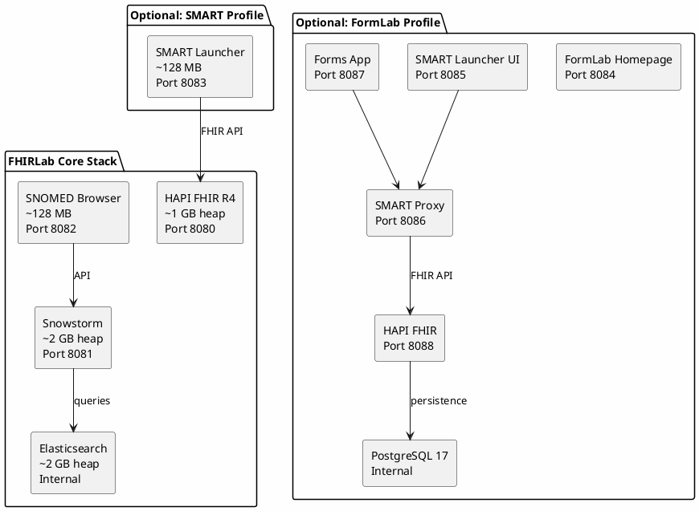
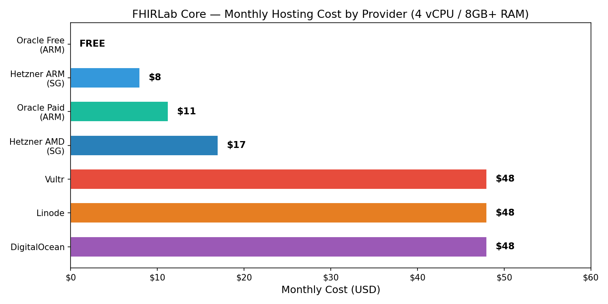
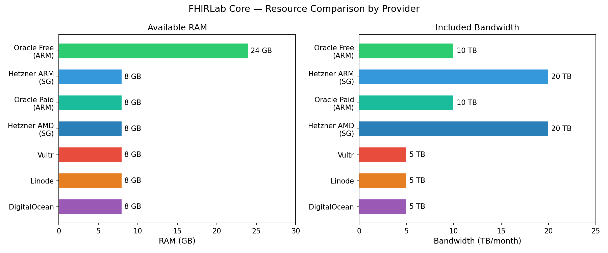
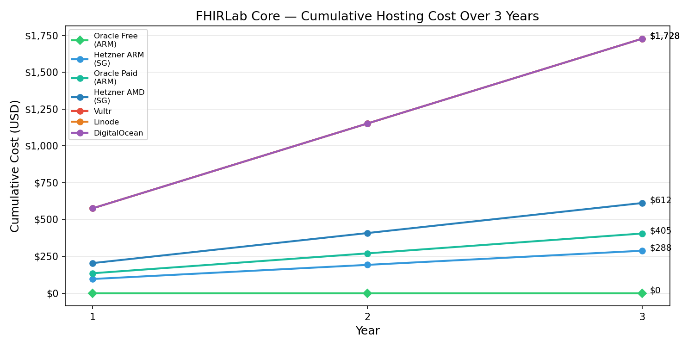
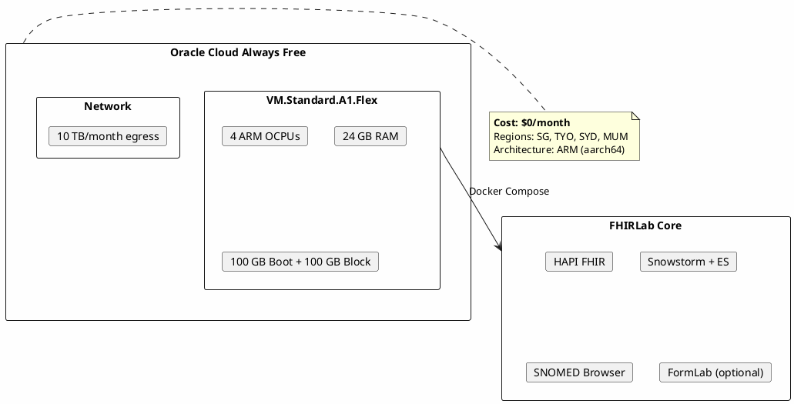
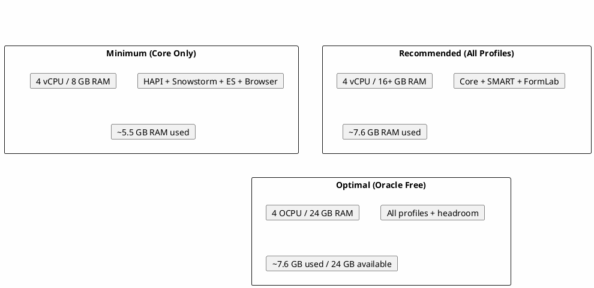

# FHIRLab Core — APAC Cloud Hosting Cost Estimate

**Date**: 2026-04-27
**Status**: Draft
**GitLab Issue**: [gitlab-profile#26](https://gitlab.com/australian-e-health-research-centre/digital-health-strengthening-standards-capability/gitlab-profile/-/issues/26)

## 1. Scope

Estimate the monthly operating cost of deploying FHIRLab Core on a low-cost cloud provider in the APAC region, so regional teams can understand the financial commitment before adoption.

### Stack Under Evaluation

The core Docker Compose stack consists of:

### Resource Requirements

| Resource | Core Stack | + SMART | + FormLab | All Profiles |
|----------|-----------|---------|-----------|-------------|
| **RAM** | ~5.5 GB | ~5.6 GB | ~7.5 GB | ~7.6 GB |
| **vCPU** | 2–4 | 2–4 | 4 | 4 |
| **Storage** | 50 GB | 50 GB | 60 GB | 60 GB |
| **Bandwidth** | < 1 TB/mo | < 1 TB/mo | < 1 TB/mo | < 1 TB/mo |

> **Minimum viable instance**: 4 vCPU, 8 GB RAM, 80–160 GB SSD.
> The README states ≥4 GB RAM, but Elasticsearch alone requires 2 GB heap plus Snowstorm at 2 GB, making 8 GB the practical minimum.

### Deployment Constraint

Per the SSCP DevOps Catchup (2026-04-17): deployment is scoped to **localhost / LAN access** using Docker Compose only. Public DNS, IP addresses, and TLS certificates are **out of scope**.

---

## 2. Provider Comparison

### Monthly Cost (4 vCPU / 8 GB+ RAM)

| Provider | Plan | Monthly | Storage | Bandwidth | Excess Egress | APAC Regions |
|----------|------|---------|---------|-----------|---------------|-------------|
| **Oracle Free** | A1.Flex 4 OCPU / 24 GB ARM | **$0** | 200 GB | 10 TB | $0.0085/GB | SG, TYO, SYD, MUM + 4 more |
| **Hetzner ARM** | CAX21 4 vCPU / 8 GB | **~$8** | 80 GB | 20 TB | ~$0.001/GB | Singapore only |
| **Oracle Paid** | A1.Flex 4 OCPU / 8 GB ARM | **~$10** | +$1.25 | 10 TB | $0.0085/GB | SG, TYO, SYD, MUM + 4 more |
| **Hetzner AMD** | CPX31 4 vCPU / 8 GB | **~$17** | 160 GB | 20 TB | ~$0.001/GB | Singapore only |
| **Vultr** | Cloud Compute 4 vCPU / 8 GB | **$48** | 160 GB | 5 TB | $0.01/GB | SG, TYO, SYD, MUM |
| **Linode** | Shared 4 vCPU / 8 GB | **$48** | 160 GB | 5 TB | $0.01/GB | SG, TYO, SYD, MUM |
| **DigitalOcean** | Regular 4 vCPU / 8 GB | **$48** | 160 GB | 5 TB | $0.01/GB | SG, SYD, BLR |

### Resource Comparison

### 3-Year Cumulative Cost

| Provider | Year 1 | Year 2 | Year 3 |
|----------|--------|--------|--------|
| Oracle Free | $0 | $0 | $0 |
| Hetzner ARM | $96 | $192 | $288 |
| Oracle Paid | $135 | $270 | $405 |
| Hetzner AMD | $204 | $408 | $612 |
| Vultr / Linode / DO | $576 | $1,152 | $1,728 |

---

## 3. Recommendation

### Primary: Oracle Cloud Free Tier (ARM)

**Why Oracle Free Tier?**

- **$0/month** — genuinely free, not a trial
- **24 GB RAM** — 3× the minimum, ample headroom for all profiles including FormLab
- **200 GB storage** — more than sufficient
- **8 APAC regions** — best coverage for target countries (Philippines, Fiji, Malaysia)
- **10 TB bandwidth** — 10× expected usage

**Caveats:**

1. **ARM architecture** — all Docker images in the stack (HAPI FHIR, Elasticsearch, Snowstorm, PostgreSQL) publish multi-arch images including `linux/arm64`. Verified:
   - `hapiproject/hapi` — multi-arch ✓
   - `docker.elastic.co/elasticsearch/elasticsearch:8.11.1` — multi-arch ✓
   - `snomedinternational/snowstorm` — multi-arch ✓
   - `postgres:17` — multi-arch ✓
2. **Capacity constraints** — Oracle Free Tier ARM instances can be difficult to provision in popular regions due to demand. Retry or try a less popular region (e.g. Osaka, Hyderabad, Melbourne).
3. **No SLA** — free tier has no uptime guarantee. Acceptable for a learning sandbox.

### Fallback: Hetzner Cloud Singapore

If Oracle Free Tier is unavailable:

| Option | Monthly | Notes |
|--------|---------|-------|
| CAX21 (ARM) | ~$8 | 4 vCPU / 8 GB / 80 GB / 20 TB BW |
| CPX31 (AMD) | ~$17 | 4 vCPU / 8 GB / 160 GB / 20 TB BW |

Hetzner is 65–85% cheaper than Vultr/Linode/DigitalOcean. Limited to Singapore in APAC, but Singapore provides reasonable latency to the Philippines, Malaysia, and broader Southeast Asia.

### Not Recommended for This Use Case

Vultr, Linode, and DigitalOcean at $48/month are **3–6× more expensive** than alternatives for equivalent specs. They offer broader APAC presence and mature ecosystems, but the cost premium is not justified for a learning sandbox with no SLA requirement.

---

## 4. Deployment Sizing by Profile

---

## 5. Summary

| | Oracle Free | Hetzner ARM | Hetzner AMD | Vultr/Linode/DO |
|---|---|---|---|---|
| **Monthly cost** | $0 | ~$8 | ~$17 | $48 |
| **Annual cost** | $0 | ~$96 | ~$204 | $576 |
| **3-year cost** | $0 | ~$288 | ~$612 | $1,728 |
| **RAM** | 24 GB | 8 GB | 8 GB | 8 GB |
| **APAC regions** | 8 | 1 (SG) | 1 (SG) | 3–4 |
| **Architecture** | ARM | ARM | x86 | x86 |
| **SLA** | None | Standard | Standard | Standard |
| **Suitable for sandbox** | ✅ | ✅ | ✅ | ✅ (overpriced) |

**Bottom line**: Oracle Cloud Free Tier at **$0/month** is the recommended choice. Hetzner Singapore at **$8–17/month** is the best paid alternative. The $48/month providers offer no meaningful advantage for this use case.

---

## References

- [Oracle Cloud Free Tier](https://www.oracle.com/cloud/free/)
- [Hetzner Cloud Pricing](https://www.hetzner.com/cloud/)
- [Vultr Pricing](https://www.vultr.com/pricing/)
- [Linode/Akamai Pricing](https://www.linode.com/pricing/)
- [DigitalOcean Pricing](https://www.digitalocean.com/pricing)
- FHIRLab Core [README](../../README.md) and [docker-compose.yml](../../docker/docker-compose.yml)

> **Note**: Prices reflect publicly listed rates as of April 2026. Verify current pricing at each provider's website before committing.
